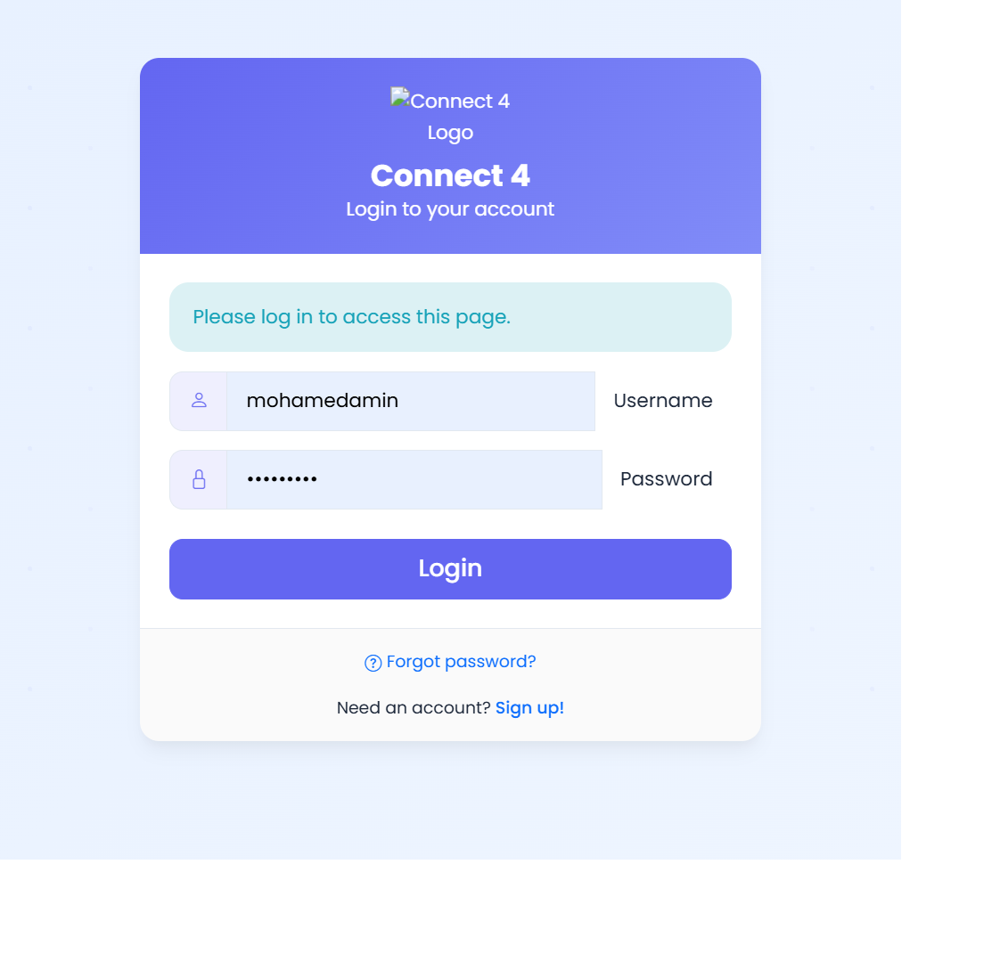
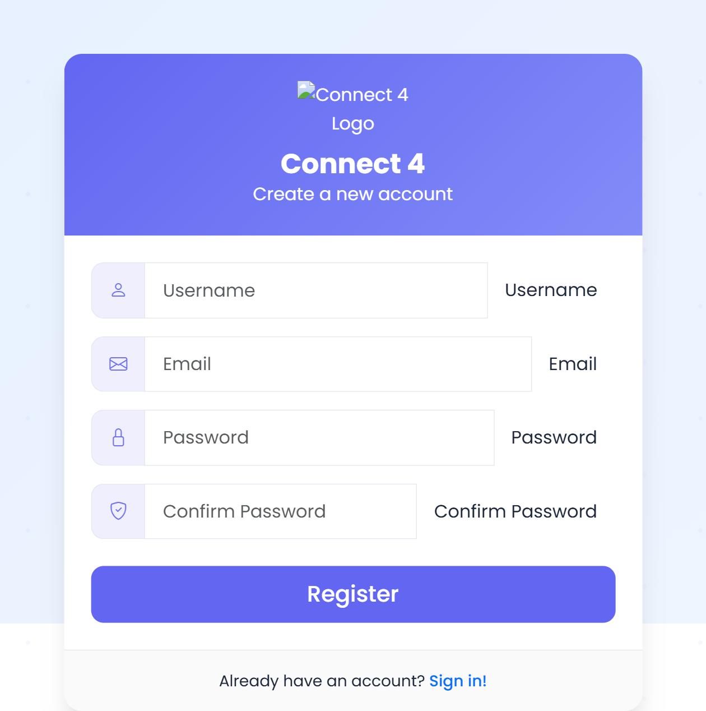
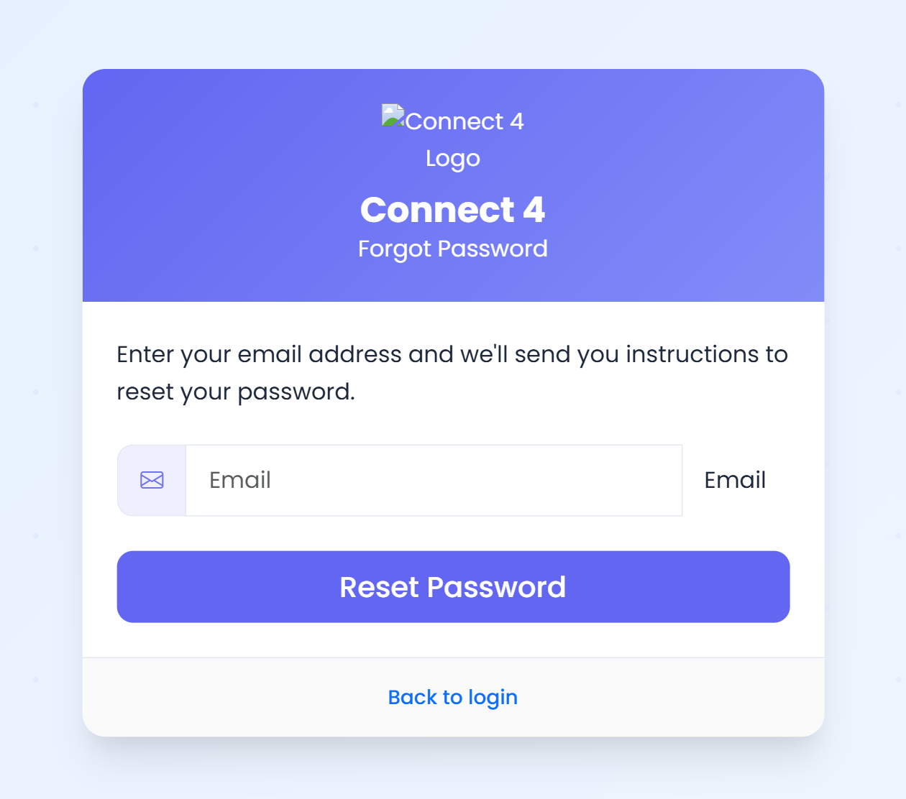
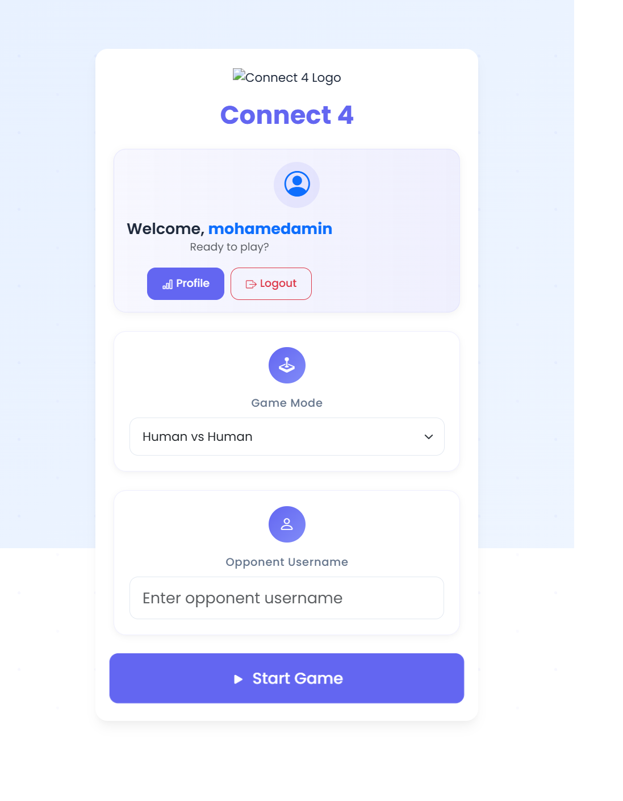
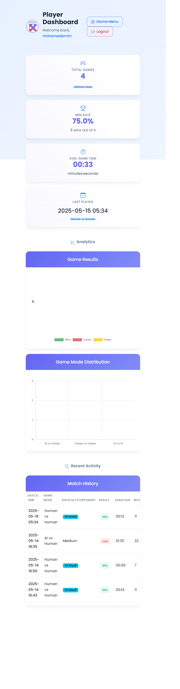

# Connect 4 Web App - لعبة كونكت 4

تطبيق ويب متكامل للعبة Connect 4 مع دعم الذكاء الاصطناعي، نظام أصدقاء، رسائل، إشعارات، ولوحة تحكم وإحصائيات.

---

## صور من الموقع (Screenshots)







---

## المميزات الرئيسية
- تسجيل دخول وتسجيل جديد
- لعب ضد الذكاء الاصطناعي أو ضد مستخدم آخر
- دعوة الأصدقاء ومراسلتهم
- إحصائيات مفصلة لكل لاعب
- واجهة حديثة وسهلة الاستخدام

---

## طريقة التشغيل (محليًا)

```bash
pip install -r requirements.txt
python run.py
```

- يتم إنشاء قاعدة بيانات SQLite تلقائيًا عند التشغيل الأول.
- يمكنك الدخول على [http://localhost:5000](http://localhost:5000)

---

## طريقة التشغيل باستخدام Docker

```bash
docker-compose up --build
```

---

## بنية المشروع

```
connect4/
│
├── auth/         # كل ما يخص المصادقة
├── dashboard/    # لوحة التحكم والإحصائيات
├── game/         # منطق اللعبة واللعب الجماعي والفردي
├── social/       # الأصدقاء والرسائل والإشعارات
├── static/       # ملفات CSS و JS وصور
├── templates/    # القوالب (داخل كل مجلد فرعي)
├── models.py     # نماذج قاعدة البيانات
├── ai.py         # ذكاء اصطناعي للعبة
├── game_logic.py # منطق اللعبة
├── run.py        # نقطة تشغيل التطبيق
├── requirements.txt
└── README.md
```

---

## English Section

### Connect 4 Web App
A full-featured Connect 4 web app with AI, friends system, messaging, notifications, and dashboard.

### Features
- Register/Login
- Play vs AI or other users
- Friend invites and messaging
- Detailed user statistics
- Modern, easy-to-use interface

### How to Run (Locally)
```bash
pip install -r requirements.txt
python run.py
```

- SQLite database is created automatically on first run.
- Visit [http://localhost:5000](http://localhost:5000)

### How to Run (Docker)
```bash
docker-compose up --build
```

---

## Project Structure

```
connect4/
│
├── auth/
├── dashboard/
├── game/
├── social/
├── static/
├── templates/
├── models.py
├── ai.py
├── game_logic.py
├── run.py
├── requirements.txt
└── README.md
```

---

## Notes
- جميع الملفات غير الضرورية تم حذفها (ملفات ترحيل/تحديث قاعدة البيانات المؤقتة، مجلدات __pycache__، إلخ)
http://localhost:5000
```

3. **Stopping the container**:

Press `Ctrl+C` in the terminal where docker-compose is running, or run:
```bash
docker-compose down
```

### Running without Docker Compose

If you prefer not to use Docker Compose, you can use these commands:

1. **Build the Docker image**:
```bash
docker build -t connect4-app .
```

2. **Run the container**:
```bash
docker run -p 5000:5000 -v $(pwd)/instance:/app/instance connect4-app
```
- On Windows PowerShell, use: `docker run -p 5000:5000 -v ${PWD}/instance:/app/instance connect4-app`

## Deploying to Docker Hub

### 1. Tag your image

After building your image, tag it with your Docker Hub username:

```bash
docker tag connect4-app sherifyani/connect4-app
```

### 2. Log in to Docker Hub

```bash
docker login
```

### 3. Push the image to Docker Hub

```bash
docker push sherifyani/connect4-app
```

### 4. Pull and run from Docker Hub

You can now pull and run the image from any machine with Docker installed:

```bash
# Pull the image
docker pull sherifyani/connect4-app

# Run the container
