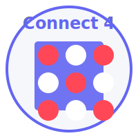

# Connect 4 Game - Dockerized Flask Application



This is a web-based Connect 4 game implemented in Flask, featuring user authentication, game logic, AI capabilities, and a dashboard for user statistics. The project has been modularized using Flask Blueprints and containerized with Docker.

## Features

- **User Authentication**: Login, registration, and password reset
- **Game Modes**: Human vs Human, AI vs Human, AI vs AI
- **Difficulty Levels**: Easy, Medium, Hard
- **Dashboard**: Display user statistics and game history
- **Responsive Design**: Modern UI/UX with Bootstrap

## Docker Setup

### Prerequisites

- Docker installed on your system ([Docker Installation Guide](https://docs.docker.com/get-docker/))
- Docker Compose (included with Docker Desktop for Windows/Mac)

### Running the Application with Docker

1. **Build and start the container using Docker Compose**:

```bash
docker-compose up --build
```

This command will:
- Build the Docker image for the application
- Start the container with proper port mapping
- Mount the database volume for data persistence

2. **Access the application**:

Once the container is running, open your browser and navigate to:
```
http://localhost:5000
```

3. **Stopping the container**:

Press `Ctrl+C` in the terminal where docker-compose is running, or run:
```bash
docker-compose down
```

### Running without Docker Compose

If you prefer not to use Docker Compose, you can use these commands:

1. **Build the Docker image**:
```bash
docker build -t connect4-app .
```

2. **Run the container**:
```bash
docker run -p 5000:5000 -v $(pwd)/instance:/app/instance connect4-app
```
- On Windows PowerShell, use: `docker run -p 5000:5000 -v ${PWD}/instance:/app/instance connect4-app`

## Deploying to Docker Hub

### 1. Tag your image

After building your image, tag it with your Docker Hub username:

```bash
docker tag connect4-app <your-dockerhub-username>/connect4-app
```

### 2. Log in to Docker Hub

```bash
docker login
```

### 3. Push the image to Docker Hub

```bash
docker push <your-dockerhub-username>/connect4-app
```

### 4. Pull and run from Docker Hub

You can now pull and run the image from any machine with Docker installed:

```bash
# Pull the image
docker pull <your-dockerhub-username>/connect4-app

# Run the container
docker run -d -p 5000:5000 -v ./instance:/app/instance <your-dockerhub-username>/connect4-app
```

## GitHub Repository

The source code is available on GitHub at https://github.com/<your-username>/connect4

To clone the repository:

```bash
git clone https://github.com/<your-username>/connect4.git
cd connect4
```

## Data Persistence

The SQLite database is stored in a volume mounted at `/app/instance` within the container. This ensures that your game data, user accounts, and statistics persist even when the container is restarted.

## Development

To modify the application:

1. Make changes to the source code
2. Rebuild the Docker image with `docker-compose up --build`
3. Restart the container to apply changes

## Environment Variables

The following environment variables can be configured in the docker-compose.yml file:

- `FLASK_APP`: The entry point to the Flask application (default: app.py)
- `FLASK_ENV`: The environment to run Flask in (development/production)

## License

This project is licensed under the MIT License - see the LICENSE file for details.
